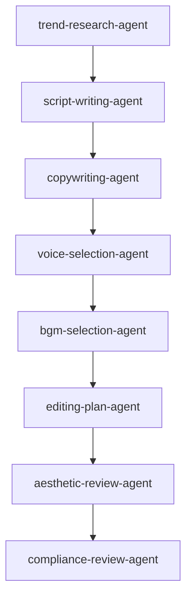

# Multi-Agent Architecture

## Purpose

The multi-agent architecture separates video creation into focused responsibilities. Each agent produces a clear output and hands it to the next agent.

## Agent Chain

## Agent Responsibilities

| Agent | Main Responsibility | Public Release Note |
|---|---|---|
| trend-research-agent | Finds public, authorized, or user-provided topic signals | Must not bypass platform limits or fabricate data |
| script-writing-agent | Creates hook, script, storyboard, and visual direction | Must avoid unverifiable claims |
| copywriting-agent | Creates title, cover copy, post text, tags, and platform variants | Must avoid misleading or exaggerated copy |
| voice-selection-agent | Chooses voice style, pace, emotion, pauses, and emphasis | Must not use unauthorized voices or clone identities |
| bgm-selection-agent | Chooses BGM mood, style, BPM, and volume | Must mark music authorization status |
| editing-plan-agent | Creates timeline, shots, captions, transitions, and export specs | Must not assume assets are licensed |
| aesthetic-review-agent | Scores and improves rhythm, visuals, captions, voice, and BGM | Must separate subjective review from fact |
| compliance-review-agent | Reviews privacy, copyright, plagiarism, hallucination, and platform risks | Final gate before production or publication |

## Collaboration Rules

- Every agent must receive explicit input and produce a structured output.
- Unknown facts must be marked as pending verification.
- Unknown licenses must be marked as pending manual confirmation.
- Trend research is for topic inspiration, not proof of truth.
- Final publication requires compliance review.
